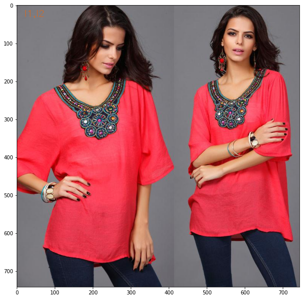

# Multilabel Image Classification

## Problem Definition

- Train a Multi-label Image Classifier

## Dataset

- Dataset is having Imbalanced and missing labels for each label.
- There are total 4 labels
- Shape: `(972,4)`
- NOTE: 3 files were not present in the `images/` directory. So, removed those information from the final csv file. (this csv will be used to train final Multilabel Image Classifier)

## Constraints

- Don't remove the rows where label/feature/column value is `NaN`. Come up with the proposal to fill these.
- Handle the imbalanced labels.

## Modeling

NOTE:

- I used `image size` for each models (`W,H=350,450`)
- I used `augmentation` also. (except vertical flip)
-

#### Filling the `NaN` values in the dataset

- To fill the `NaN` values in the dataset I used `Self-Training`. In `Self-Training` I splitted the dataset into `TRAIN` and `TEST` split first. `TEST` dataset contains those rows where there is `NaN` value.
  I further splitted the `TRAIN` into `TRAIN` and `VAL`.
- I did the above step for each `label`.
- And then finally `trained` the `VGG19` model with some added `Conv2D` layers. (NOTE: I freezed the `VGG19` layers and trained only the layers added by me.)
- To handle the `imbalance` I used oversampling the minority class.
- This trained model is used to fill the `NaN` value.
- This is the way we get our final dataset to train Multilable Image Classifier.
- `Metrics` used for the binary classifier are:
  - TP (True Positive)
  - FP (False Positive)
  - TN (True Negative)
  - FN (False Negative)
  - Precision
  - Recall
  - BinaryAccuracy
  - AUC (**main metric to validate the model**)
  - PR-Curve (Precision-Recall Curve)

#### Training Multilabel Classifier

- I used pre-trained `VGG19` model with `imagenet` weight, and added a few `Conv2D` layers on top of this. I `freezed` all the layers of `VGG19` and trained only the layers added by me.
- I used `Adam` as an optimizer with learning rate `0.00001`. I tried other optimizers but that didn't work.
- I trained for `40` `epochs` with early stop with patience `5`. I saved the best model.
- `Metrics` used for `Multilabel Classifier`:
  - BinaryAccuracy
  - AUC (_for multilabel, means AUC will be calculated for each of the label and then will be averaged_)

## Limitations

- As we are using `Self-Training` for filling `NaN` values. This will be performance bottleneck as these labels accuracy or robustness is dependent on the models we trained to fill these values.

## Tried, and Didn't work

- Tried to finetune `ResNet50` but didn't work.
- Tried to use other optimizers like `Adadelta`, `Adagrad`, `RMSProp` but even these didn't work better than `Adam`.
- Tried `class_weight` to handle imbalance but used to overfit to minority class (which is being given more weight). So, finally used upsampling and it worked.

## TODO

There are many things to be done, few of them are below:

- Try to use different pre-trained models like `MobileNet`, `EfficientNet`, `Xception`, etc.
- Try to train the model with better learning rate schedulers to not overfit to any particular label.
- Train the model with imbalanced dataset itself and comp up with tuning the `threshold` values to get better performance.
- And try using other robust metrices designed for `multilabel classification` like: `Hamming score`, and `Jaccard similarity/index`, etc.
- For imbalanced training the model (might be with class_weight), come up with metrices like `G-mean(geometric mean score)`, `specificity`, `sensitivity`, etc.
- For Interpretaion, use [`LIME`](https://github.com/marcotcr/lime/blob/master/doc/notebooks/Tutorial%20-%20Image%20Classification%20Keras.ipynb) to get why It is giving the particular prediction to trust the model.
- Try with `Focal loss`, especially designed to handle imbalanced dataset.

## Results

#### Loss multilabel

#### Accuracy multilabel

#### AUC multilabel

#### Inference result sample

